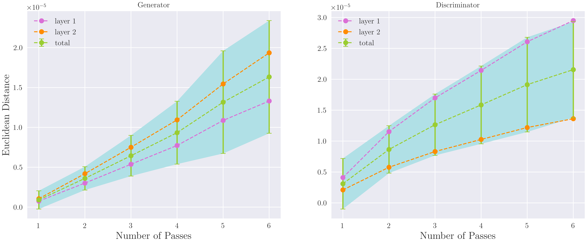

## Stability of GAN

### GAN Struction
We consider the vanilla GAN structure in Goodfellow et al. (2014).
We do not use the Dropout layer in the discriminator in order to maintain the original parameters for comparison.

### Loss Function
We use the Binary Cross Entropy (BCE), which corresponds to the modified GAN loss in Goodfellow et al. (2014).

### Algorithm
The algorithm we choose is mini-batch synchronous SGD.
It is synchronous because we use same noise for updating D and G.
We will not do weight decay in order to fairly compare parameters.

### Dataset 
We consider the common dataset `mnist`. 
We create two neighborhood datasets by removing one neighborhood example.
We will run the same track on the neighborhood datasets.

### Stability Proxy
We compute the Euclidean distance, i.e. Frobenius norm, between the parameters trained on the neighborhood datasets.

### Cross Validation
- By picking different examples to mask
- Different noises only when examples are different
- Different seeds 

### Results

### Difference vs GAN training
- Finite sample for random noise
- Synchronous noise for updating D and G

### Future Work
- Different datasets e.g. `cifar10`, `TFD`
- Convolutional GAN structure e.g. DCGAN
- Different loss functions e.g. LSGAN, WGAN
- Infinite noise sampling, a tailored stability definition for GAN?
