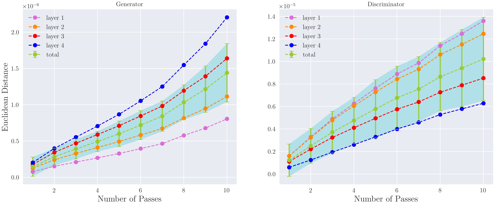

## Stability and Generalization of Stochastic Gradient Methods for Minimax Problems

Welcome to the repository of minimax-stability! This repository is only for reproducing all experimental results shown in our paper:

[*Stability and Generalization of Stochastic Gradient Methods for Minimax Problems*.](https://arxiv.org/abs/2105.03793) Yunwen Lei\*, Zhenhuan Yang\*, Tianbao Yang, Yiming Ying. ICML 2021. (\* Equal Contribution)

### Requirement

```
python=3.6
numpy=1.19.2
sicit-learn=0.24.1
scipy=1.5.4
pytorch=1.7.1
torchvision=0.8.2
tqdm=4.59.0
pillow=8.1.2
```

### Citation
If you find this repository useful, please cite our work
```
@article{lei2021stability,
  title={Stability and Generalization of Stochastic Gradient Methods for Minimax Problems},
  author={Lei, Yunwen and Yang, Zhenhuan and Yang, Tianbao and Ying, Yiming},
  journal={arXiv preprint arXiv:2105.03793},
  year={2021}
}
```

### GAN Struction
We consider the vanilla GAN structure in Goodfellow et al. (2014).
We do not use the Dropout layer in the discriminator in order to maintain the original parameters for comparison.

### Loss Function
We use the Binary Cross Entropy (BCE), which corresponds to the modified GAN loss in Goodfellow et al. (2014).

### Algorithm
The algorithm we choose is mini-batch synchronous SGD.
It is synchronous because we use same noise for updating D and G.
We will not do weight decay in order to fairly compare parameters.

### Dataset 
We consider the common dataset `mnist`. 
We create two neighborhood datasets by removing one neighborhood example.
We will run the same track on the neighborhood datasets.

### Stability Proxy
We compute the Euclidean distance, i.e. Frobenius norm, between the parameters trained on the neighborhood datasets.

### Cross Validation
- By picking different examples to mask
- Different noises only when examples are different
- Different seeds 

### Results



### Explanation
- In generator, the layers more close to the front have smaller distances because there are less parameters. The discriminator is the other way around.
- The distance grows with the number of passes, which is consistent with our Theorem 5 and Theorem 6.

### Difference vs GAN training
- Finite sample for random noise
- Synchronous noise for updating D and G

### Future Work
- Different datasets e.g. `cifar10`, `TFD`
- Convolutional GAN structure e.g. DCGAN
- Different loss functions e.g. LSGAN, WGAN
- Infinite noise sampling, a tailored stability definition for GAN?
