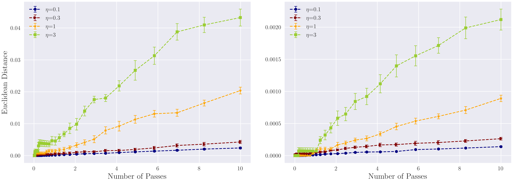

## Stability and Generalization of Stochastic Gradient Methods for Minimax Problems

Welcome to the repository of minimax-stability! This repository is only for reproducing all experimental results shown in our paper:

[*Stability and Generalization of Stochastic Gradient Methods for Minimax Problems*.](https://arxiv.org/abs/2105.03793) Yunwen Lei\*, Zhenhuan Yang\*, Tianbao Yang, Yiming Ying. ICML 2021. (\* Equal Contribution)

### Requirement

```
python=3.6
numpy=1.19.2
sicit-learn=0.24.1
scipy=1.5.4
pytorch=1.7.1
torchvision=0.8.2
tqdm=4.59.0
pillow=8.1.2
```

### Citation
If you find this repository useful, please cite our work
```
@article{lei2021stability,
  title={Stability and Generalization of Stochastic Gradient Methods for Minimax Problems},
  author={Lei, Yunwen and Yang, Zhenhuan and Yang, Tianbao and Ying, Yiming},
  journal={arXiv preprint arXiv:2105.03793},
  year={2021}
}
```

### Stability Proxy
We compute the Euclidean distance, i.e. Frobenius norm, between the parameters trained on the neighborhood datasets.


### Stability of SOLAM on AUC maximization



### Stability of SGDA on GAN training


### Future Work
- Different datasets e.g. `cifar10`, `TFD`
- Convolutional GAN structure e.g. DCGAN
- Different loss functions e.g. LSGAN, WGAN
- Infinite noise sampling, a tailored stability definition for GAN?
